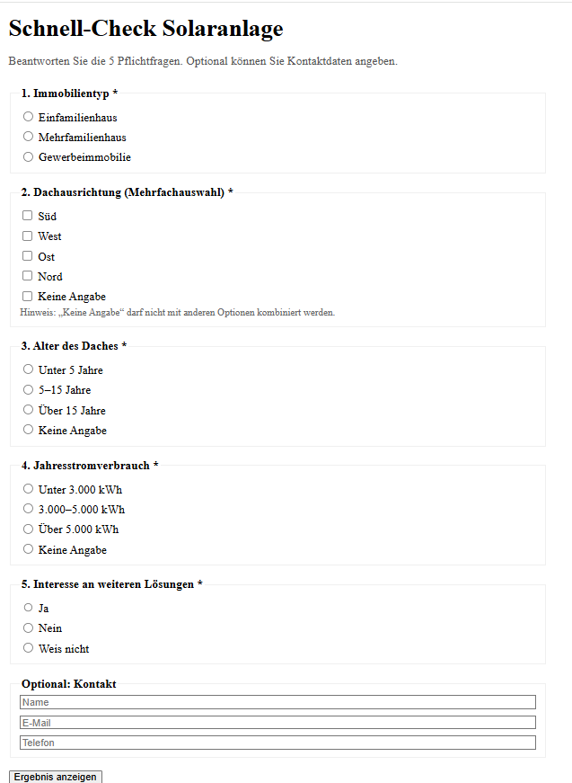
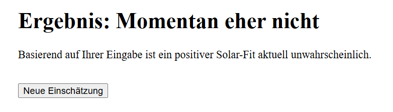

# Solar Survey

A 5-step survey app that helps users check whether a solar system might be suitable for their property.  

Built with **Next.js 15 (App Router)**, **TypeScript**, **Zod**, and **Tailwind CSS**.

---

## Features

- **Survey Form**
  - 5 required questions (property type, roof orientation, roof age, consumption, interest in other solutions).
  - Optional contact info (name, email, phone).
- **Validation**
  - Server-side validation using **Zod** ensures correct and safe input.
  - Business rule enforced: `"Keine Angabe"` (not specified) cannot be combined with other orientations.
- **API Endpoint**
  - `POST /api/submit` accepts survey payload.
  - Responds with a random **yes/no** verdict.
- **Results**
  - Two styled result screens (positive or negative).
  - Reset button to return to the survey form.
- **UI/UX**
  - Modern responsive design using Tailwind CSS.
  - Clean typography, green accent color, and error handling messages.

---

## Screenshots

### Survey Form:


### Result Screen:


---

## Getting Started

### 1. Clone the repository
```bash
git clone https://github.com/monikabhole001/solar-survey.git
cd solar-survey
```

### 2. Install dependencies
```bash
npm install
```

### 3. Run the development server
```bash
npm run dev
```

Then open [http://localhost:3000](http://localhost:3000) in your browser.

---

## API Endpoint Details

**URL**  
```
POST /api/submit
```

**Example Request**
```json
{
  "propertyType": "Einfamilienhaus",
  "orientations": ["Süd"],
  "roofAge": "Unter 5 Jahre",
  "annualConsumption": "3.000–5.000 kWh",
  "interestedInOtherSolutions": "Ja"
}
```

**Example Responses**
```json
{ "verdict": "yes" }
```
or
```json
{ "verdict": "no" }
```

**Example Validation Error**
```json
{
  "errors": {
    "fieldErrors": {
      "orientations": [
        "\"Keine Angabe\" darf nicht mit anderen Optionen kombiniert werden"
      ]
    }
  }
}
```

---

## Tech Stack

- [Next.js 15](https://nextjs.org/) — React framework with App Router  
- [TypeScript](https://www.typescriptlang.org/) — static typing  
- [Zod](https://zod.dev/) — schema-based validation  
- [Tailwind CSS](https://tailwindcss.com/) — styling framework  

---
